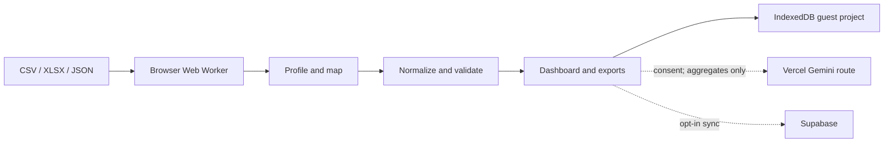

# InsightWeaver

InsightWeaver turns a real CSV, XLSX, or JSON file into an auditable business-analysis project. It profiles columns, asks users to resolve ambiguous meaning, normalizes values, validates data quality, builds evidence-linked dashboards, drafts an optional Gemini executive brief, and exports a reproducible artifact bundle.

The deterministic pipeline runs in a Web Worker inside the browser. Guest projects stay in IndexedDB. Supabase cloud sync and Gemini analysis are optional and consent-gated.

## What works

- Real browser-side CSV, XLSX, and JSON processing; no preset substitution
- 25 MB, 100,000-row, and 200-column safety limits
- Semantic mapping with preserved original headers
- ISO-first dates and explicit DMY/MDY review for ambiguous dates
- Separate revenue, expense, refund, balance, and generic amount roles
- No cross-currency total without conversion rules
- Exact duplicate removal, missingness, future-date, and IQR anomaly checks
- Evidence-backed KPIs, configurable bar/line/area/donut/scatter charts, breakdowns, preview, and workflow trace
- IndexedDB history and offline-capable PWA
- Eight-file ZIP export derived from the active project
- Optional Gemini 2.5 Flash through a protected Vercel Function
- Optional passwordless Supabase projects with owner-only RLS
- Three labelled synthetic portfolio showcases

## Run and verify

Requires Node.js 22+ and npm 10+.

```bash
npm install
npm run dev
npm run check
npx playwright install chromium
npm run test:e2e
```

Open `http://localhost:5173`. Guest mode needs no account or environment variables. Copy `.env.example` to `.env.local` only when connecting hosted services. Never expose the Supabase secret or Gemini key with a `VITE_` prefix.

## Architecture



Raw files and full row collections are rejected by the AI route. Cloud sync is opt-in. RLS and Storage policies live in `supabase/migrations`.

Each bundle contains `normalized.csv`, `schema.json`, `validation.json`, `dashboard.json`, `report.json`, `workflow.json`, `executive-brief.md`, and `manifest.json`. Schema version `1` is persisted throughout.

See [Architecture](docs/ARCHITECTURE.md), [Privacy](docs/PRIVACY.md), [Deployment](docs/DEPLOYMENT.md), [Security](SECURITY.md), and [Contributing](CONTRIBUTING.md).

MIT © Shivansh Gupta
